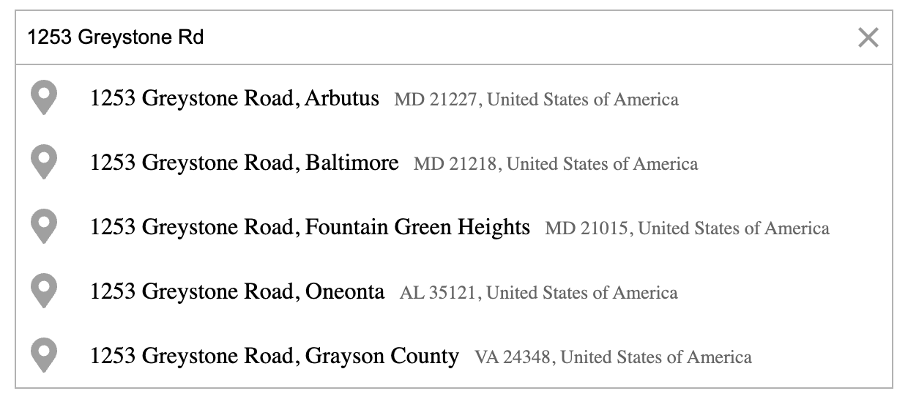

# Geoapify Geocoder Autocomplete

The **Geoapify Geocoder Autocomplete** is a **JavaScript / TypeScript** library for adding address and place autocomplete to web applications and HTML pages. It helps users find and select location suggestions while improving form usability and map interaction.

Powered by Geoapify’s APIs, the library combines the strengths of:

* [**Address Autocomplete API**](https://www.geoapify.com/address-autocomplete/) — for real-time, high-quality address and place suggestions as the user types.
* [**Places API**](https://www.geoapify.com/places-api/) — for category-based search and exploring points of interest such as restaurants, cafes, and landmarks.

By integrating both APIs, the library supports intelligent **address search**, **autofill**, and **category-based place discovery** within a single, easy-to-use component. It can be embedded in any modern web app, works without UI frameworks, and is fully compatible with mapping libraries like **Leaflet**, **MapLibre GL**, or **OpenLayers**.

## Features

1. **Easy to Integrate**
   Add address or place autocomplete to a web page or application. The component renders inside an HTML container and can be connected to an existing UI or map.

2. **Fine-Tuning and Control**
   Adjust search behavior with **filters** and **bias parameters** — limit results by country, bounding box, circle, or proximity. This flexibility helps return the most relevant and context-aware suggestions for your users.

3. **Structured Address Collection**
   Use the library to build structured address input forms and fill city, postal code, and country fields from a selected result. For delivery or other precision-sensitive workflows, let users review and confirm the selected location.

4. **Optional Place Details Integration**
   Enhance selected results with detailed information and geometries by connecting to the [Geoapify Place Details API](https://www.geoapify.com/place-details-api/). Retrieve building outlines, city boundaries, and additional metadata for improved map visualization.

5. **Optional Category Search**
   Extend the autocomplete to support category-based search using the [Geoapify Places API](https://www.geoapify.com/places-api/). Let users explore nearby points of interest such as restaurants, hotels, or gas stations directly from the dropdown.

6. **Customizable Look and Feel**
   Style the autocomplete to match your application’s design. Choose from built-in light and dark themes or override styles using your own CSS classes for complete visual consistency.

7. **Zero Dependencies**
   Built with no external dependencies, the library is lightweight, fast, and framework-agnostic. It integrates easily with any modern frontend or map library such as Leaflet, MapLibre GL, or OpenLayers.

## Learn more

* [**API Reference**](api-reference/geocoder-autocomplete.md) – Explore all available methods, options, and event callbacks.
* [**Geoapify Geocoding & Autocomplete API Documentation**](https://apidocs.geoapify.com/docs/geocoding/) – Detailed API descriptions, parameters, and response formats.
* [**API Playground**](https://apidocs.geoapify.com/playground/geocoding/#autocomplete) – Try the autocomplete interactively and experiment with API parameters.
* [**JSFiddle Demos**](live-demos.md#jsfiddle-demos) – Live examples showing how to integrate the autocomplete with maps and forms.
* [**Live Demo Collection**](live-demos.md#live-demo-collection) – Run ready-made demo projects to explore advanced integrations.
