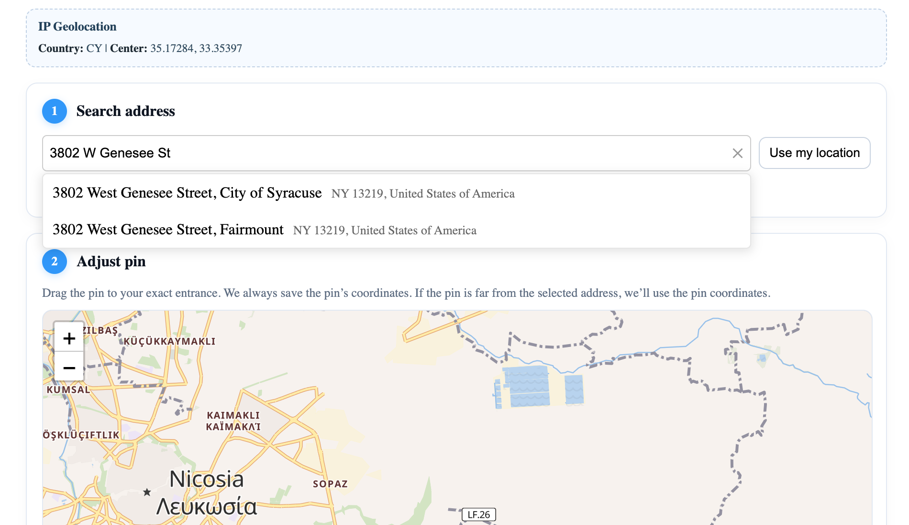
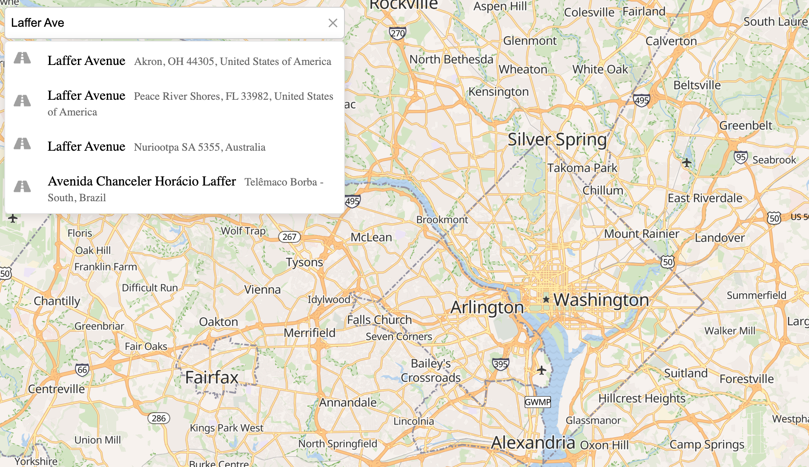
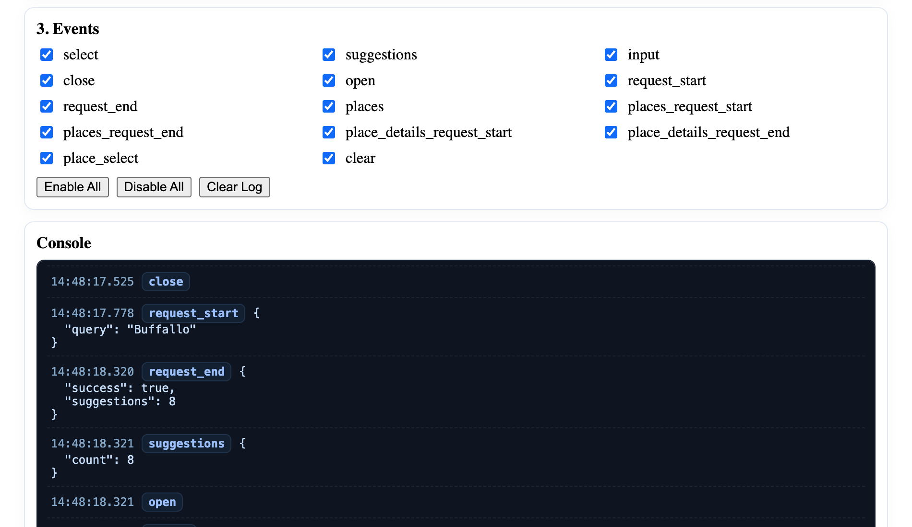
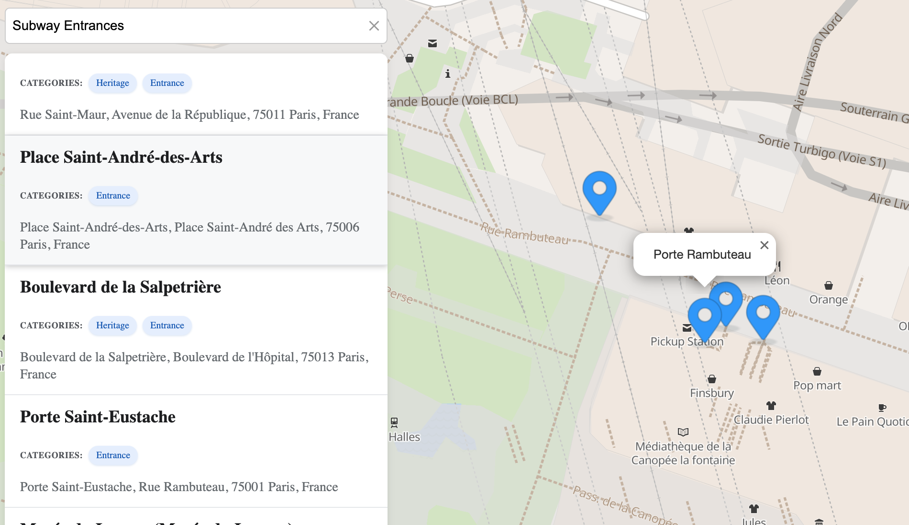

Explore how the **Geoapify Geocoder Autocomplete** works in real-world scenarios.
You can try it directly in the online playground or experiment with live examples that demonstrate integration with maps, address forms, and custom geocoding logic.

### API Playground

Test the autocomplete behavior interactively in the Geoapify Playground.
Experiment with different parameters such as input text, bias options, country filters, and language to see how the suggestions adapt in real time.

* [Open the Playground](https://apidocs.geoapify.com/playground/geocoding/#autocomplete)

---

### JSFiddle Demos

#### Address Autocomplete with Maps

Live examples showing how to integrate the autocomplete field with map libraries:

* [Address Field + Leaflet Map](https://jsfiddle.net/Geoapify/jsgw53z8/)
* [Address Field + MapLibre GL Map](https://jsfiddle.net/Geoapify/sf3hp2a6/)

#### Address Form Examples

Simple address form demos showcasing how to implement address search and autocomplete for user input:

* [Address Form 1](https://jsfiddle.net/Geoapify/t0eg541k/)
* [Address Form 2](https://jsfiddle.net/Geoapify/stgek5wf/)

#### Shipping and Delivery Example

Demonstrates how to retrieve precise address details for delivery and logistics:

* [Getting Precise Location for Shipping](https://jsfiddle.net/Geoapify/g9xhcye0/)

#### Custom Geocoding Example

Demonstrates how to configure a custom geocoding function to return countries, states, cities, and counties using Geoapify’s Address Autocomplete API:

* [Custom Geocoding Function](https://jsfiddle.net/Geoapify/916oxfja/)

---

### Live Demo Collection

A full set of ready-to-run demo projects is available in the repository. These examples show how to use the autocomplete in various contexts, from simple forms to complex map integrations.

| Preview | Description |  |  |
|---|---|---|---|
|  | One Field Address Form — Single-field input with autocomplete | [Open](https://geoapify.github.io/geocoder-autocomplete/demo/address-form-one-field/index.html) | [Source](https://github.com/geoapify/geocoder-autocomplete/tree/master/demo/address-form-one-field) |
|  | Multi-field Address Form — Step-by-step input from country to house number | [Open](https://geoapify.github.io/geocoder-autocomplete/demo/address-form-from-country-to-housenumber/index.html) | [Source](https://github.com/geoapify/geocoder-autocomplete/tree/master/demo/address-form-from-country-to-housenumber) |
|  | Address Form with Map — Combined address search and interactive map | [Open](https://geoapify.github.io/geocoder-autocomplete/demo/address-form-search-plus-map/index.html) | [Source](https://github.com/geoapify/geocoder-autocomplete/tree/master/demo/address-form-search-plus-map) |
|  | Autocomplete Features — Types — Filtering by location type | [Open](https://geoapify.github.io/geocoder-autocomplete/demo/autocomplete-features-types/index.html) | [Source](https://github.com/geoapify/geocoder-autocomplete/tree/master/demo/autocomplete-features-types) |
|  | Autocomplete Features — Filters & Bias — Demonstrates filter and bias options | [Open](https://geoapify.github.io/geocoder-autocomplete/demo/autocomplete-features-filters-and-bias/index.html) | [Source](https://github.com/geoapify/geocoder-autocomplete/tree/master/demo/autocomplete-features-filters-and-bias) |
|  | Autocomplete Features — Events — Shows available events and callbacks | [Open](https://geoapify.github.io/geocoder-autocomplete/demo/autocomplete-features-events/index.html) | [Source](https://github.com/geoapify/geocoder-autocomplete/tree/master/demo/autocomplete-features-events) |
|  | Places Search — No Map — Category search with built-in places list | [Open](https://geoapify.github.io/geocoder-autocomplete/demo/places-seach-no-map-built-in-list/index.html) | [Source](https://github.com/geoapify/geocoder-autocomplete/tree/master/demo/places-seach-no-map-built-in-list) |
|  | Leaflet Integration — Interactive map with address search and markers | [Open](https://geoapify.github.io/geocoder-autocomplete/demo/integration-with-leaflet/index.html) | [Source](https://github.com/geoapify/geocoder-autocomplete/tree/master/demo/integration-with-leaflet) |
|  | Leaflet with Custom Places UI — Category search with custom places list | [Open](https://geoapify.github.io/geocoder-autocomplete/demo/places-search-leaflet-custom-list/index.html) | [Source](https://github.com/geoapify/geocoder-autocomplete/tree/master/demo/places-search-leaflet-custom-list) |
|  | Leaflet with Built-in Places List — Category search with built-in places list | [Open](https://geoapify.github.io/geocoder-autocomplete/demo/places-search-leaflet-built-in-list/index.html) | [Source](https://github.com/geoapify/geocoder-autocomplete/tree/master/demo/places-search-leaflet-built-in-list) |
|  | MapLibre GL Integration — Vector map with reverse geocoding on click | [Open](https://geoapify.github.io/geocoder-autocomplete/demo/integration-with-maplibre-gl/index.html) | [Source](https://github.com/geoapify/geocoder-autocomplete/tree/master/demo/integration-with-maplibre-gl) |
